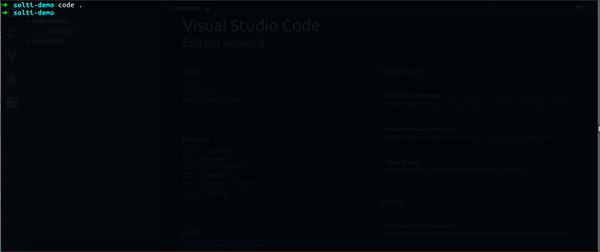

# Solti

Solti is an cli tool to generate React & Vue Component decorated with patterns that are widely used and mostly taken from site [React Patterns](https://reactpatterns.com/) and others.

##### Some of the patterns used in React (Checked are available):

* [x] Simple Component
* [x] [Higher-order component](https://reactpatterns.com/#higher-order-component)
* [x] [Stateless function](https://reactpatterns.com/#stateless-function)
* [x] [JSX spread attributes](https://reactpatterns.com/#jsx-spread-attributes)
* [x] [Destructuring arguments](https://reactpatterns.com/#destructuring-arguments)
* [ ] [Conditional rendering](https://reactpatterns.com/#conditional-rendering)
* [ ] [Children types](https://reactpatterns.com/#children-types)
* [ ] [Array as children](https://reactpatterns.com/#array-as-children)
* [ ] [Function as children](https://reactpatterns.com/#function-as-children)
* [ ] [Render callback](https://reactpatterns.com/#render-callback)
* [ ] [Children pass-through](https://reactpatterns.com/#children-pass-through)
* [ ] [Proxy component](https://reactpatterns.com/#proxy-component)
* [ ] [Style component](https://reactpatterns.com/#style-component)
* [ ] [Event switch](https://reactpatterns.com/#event-switch)
* [x] [Layout component](https://reactpatterns.com/#layout-component)
* [ ] [Container component](https://reactpatterns.com/#container-component)
* [ ] [State hoisting](https://reactpatterns.com/#state-hoisting)
* [x] [Controlled input](https://reactpatterns.com/#controlled-input)

##### Some of the patterns used in Vue (Checked are available):

* [x] Simple Component
* [x] [Functional Component](https://alligator.io/vuejs/functional-components/)

## Install

### NPM

`npm i -g solti`

### Yarn

`yarn global add solti`

## Usage

From your project on any location you can run `solti` on your terminal
which will ask some simple questions:

## Options
   `--with-docs`: Will generate component with available documentation on top of every component.
